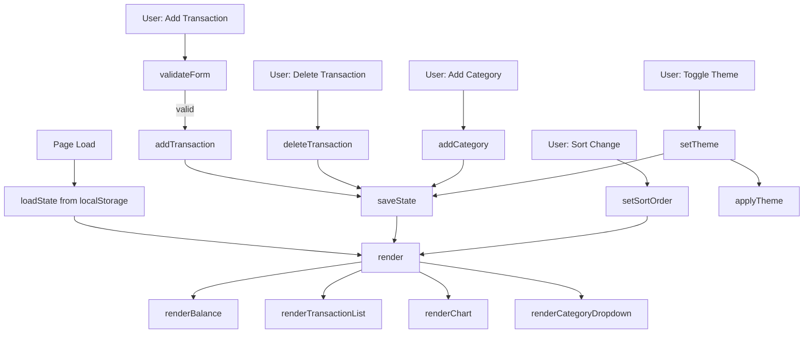

# Design Document: Expense & Budget Visualizer

## Overview

The Expense & Budget Visualizer is a single-page, zero-backend web application built with HTML, Tailwind CSS (CDN), and Vanilla JavaScript. All state lives in the browser: transactions and preferences are persisted to `localStorage`, and the entire UI is re-rendered synchronously on every state mutation. There is no build step, no module bundler, and no server — the app opens directly as `index.html` in any modern browser.

The design follows a simple unidirectional data flow:

```
User Action → State Mutation → localStorage Write → UI Re-render
```

All UI updates (balance, transaction list, chart) happen within a single `render()` call triggered after every state change, satisfying the ≤100ms update requirement.

---

## Architecture

### High-Level Flow



### Technology Stack

| Concern | Technology |
|---|---|
| Markup | HTML5 |
| Layout & Utilities | Tailwind CSS via CDN |
| Custom styles (Neomorphism, animations) | `css/styles.css` |
| Application logic | `js/app.js` (single file) |
| Charts | Chart.js via CDN |
| Icons | Bootstrap Icons via CDN |
| Persistence | `localStorage` API |

---

## File / Folder Structure

```
index.html          ← single HTML page, all CDN links, DOM skeleton
css/
  styles.css        ← Neomorphism shadows, animations, theme variables
js/
  app.js            ← all application logic (state, render, events)
```

No other files are required.

---

## Components and Interfaces

### HTML Structure

```
<body>
  <header>                          ← app title + theme toggle button
  <main>
    <section id="balance-section">  ← total balance display
    <section id="input-section">
      <form id="transaction-form">  ← item name, amount, category dropdown,
        ...                            add-category sub-form, submit button
    <section id="sort-section">     ← sort control (select or button group)
    <section id="list-section">
      <ul id="transaction-list">    ← scrollable list of transaction items
    <section id="chart-section">
      <canvas id="spending-chart">  ← Chart.js pie chart
  <footer>                          ← copyright, contact, links, GitHub icon
```

### Component Responsibilities

| Component | Responsibility |
|---|---|
| Header | Display title; host theme toggle |
| Balance Section | Show computed sum of all amounts |
| Input Form | Collect name/amount/category; validate; emit add event |
| Add-Category Sub-form | Collect new category name; validate uniqueness |
| Sort Control | Expose sort options; emit sort-change event |
| Transaction List | Render sorted list; host per-item delete buttons |
| Chart Section | Render Chart.js pie; show placeholder when empty |
| Footer | Static content + Bootstrap Icons GitHub link |

---

## Data Models

### Transaction Object

```js
{
  id: string,        // crypto.randomUUID() or Date.now().toString()
  name: string,      // item name, non-empty
  amount: number,    // positive float, e.g. 12.50
  category: string   // category label, e.g. "Food"
}
```

### App State Object (in-memory)

```js
{
  transactions: Transaction[],   // ordered by insertion time
  categories: string[],          // default + custom categories
  sortOrder: SortOrder,          // see below
  theme: "light" | "dark"
}
```

### SortOrder Type

```js
// one of:
"none"             // insertion order (default)
"amount-asc"
"amount-desc"
"category-asc"    // alphabetical by category label
```

### localStorage Keys

| Key | Value | Description |
|---|---|---|
| `ebv_transactions` | `JSON.stringify(Transaction[])` | All persisted transactions |
| `ebv_categories` | `JSON.stringify(string[])` | All category labels (default + custom) |
| `ebv_theme` | `"light"` or `"dark"` | Persisted theme preference |
| `ebv_sort` | SortOrder string | Persisted sort preference |

### Default Categories

```js
const DEFAULT_CATEGORIES = ["Food", "Transport", "Fun", "Health", "Other"];
```

---

## JavaScript Module / Function Design

All logic lives in `js/app.js`. The file is structured in clear sections:

### State Management

```js
// Mutable singleton state
let state = {
  transactions: [],
  categories: [...DEFAULT_CATEGORIES],
  sortOrder: "none",
  theme: "light"
};

function loadState()          // reads all localStorage keys, populates state
function saveState()          // writes all state keys to localStorage
function saveTransactions()   // writes only ebv_transactions
function saveCategories()     // writes only ebv_categories
function saveTheme()          // writes only ebv_theme
function saveSort()           // writes only ebv_sort
```

### Transaction Operations

```js
function addTransaction(name, amount, category)  // mutates state, saves, renders
function deleteTransaction(id)                   // mutates state, saves, renders
function getSortedTransactions()                 // returns sorted copy of state.transactions
```

### Category Operations

```js
function addCategory(name)          // validates uniqueness (case-insensitive), mutates, saves, renders
function categoryExists(name)       // returns boolean
```

### Validation

```js
function validateTransactionForm(name, amount, category)
  // returns { valid: boolean, errors: string[] }

function validateCategoryName(name)
  // returns { valid: boolean, error: string | null }
```

### Rendering

```js
function render()                   // orchestrates all sub-renders
function renderBalance()            // computes sum, updates DOM text
function renderTransactionList()    // clears + rebuilds <ul> from getSortedTransactions()
function renderChart()              // updates or creates Chart.js instance
function renderCategoryDropdown()   // rebuilds <select> options
function showEmptyState()           // shows/hides empty-state message
function showChartPlaceholder()     // shows/hides chart placeholder
```

### Theme

```js
function applyTheme(theme)          // adds/removes 'dark' class on <html>, updates toggle icon
function toggleTheme()              // flips state.theme, saves, applies
```

### Chart

```js
let chartInstance = null;           // Chart.js singleton

function buildChartData()
  // returns { labels: string[], data: number[], colors: string[] }
  // aggregates amounts per category from state.transactions

function CATEGORY_COLORS
  // fixed map of category name → hex color for consistent coloring
  // falls back to a deterministic color generator for custom categories
```

### Event Wiring

```js
function initEventListeners()       // called once on DOMContentLoaded
  // wires: form submit, delete clicks (event delegation on list),
  //        sort change, add-category submit, theme toggle
```

### Initialization

```js
document.addEventListener("DOMContentLoaded", () => {
  loadState();
  applyTheme(state.theme);
  render();
  initEventListeners();
});
```

---

## CSS / Theming Approach

### Tailwind CSS

Used for all layout, spacing, typography, and responsive utilities via CDN. Responsive breakpoints follow Tailwind defaults (`sm: 640px`, `md: 768px`, `lg: 1024px`).

### Custom CSS (`css/styles.css`)

Handles two concerns Tailwind cannot express cleanly:

**1. Neomorphism shadows**

```css
/* Light mode neomorphic surface */
.neo {
  background: #e0e5ec;
  box-shadow:  6px 6px 12px #b8bec7, -6px -6px 12px #ffffff;
  border-radius: 12px;
}

/* Dark mode neomorphic surface */
.dark .neo {
  background: #1e2130;
  box-shadow:  6px 6px 12px #141620, -6px -6px 12px #282a3a;
}
```

**2. Hover / interaction animations**

```css
.neo-btn {
  transition: box-shadow 0.15s ease, transform 0.15s ease;
}
.neo-btn:hover {
  box-shadow: 2px 2px 6px #b8bec7, -2px -2px 6px #ffffff;
  transform: translateY(-1px);
}
.neo-btn:active {
  box-shadow: inset 3px 3px 6px #b8bec7, inset -3px -3px 6px #ffffff;
  transform: translateY(0);
}
```

### Theme Implementation

Dark mode is toggled by adding/removing the `dark` class on `<html>`. Tailwind's `darkMode: 'class'` strategy is used (configured via the CDN config object). CSS custom properties bridge Tailwind and the custom Neomorphism styles.

```html
<!-- Tailwind CDN config -->
<script>
  tailwind.config = { darkMode: 'class' }
</script>
```

### Color Palette

| Role | Light | Dark |
|---|---|---|
| Surface | `#e0e5ec` | `#1e2130` |
| Text primary | `#1a1a2e` | `#e0e5ec` |
| Accent blue | `#3b82f6` | `#60a5fa` |
| Danger (delete) | `#ef4444` | `#f87171` |

---

## Chart.js Integration Design

Chart.js is loaded via CDN. A single `<canvas id="spending-chart">` element is the render target.

### Instance Lifecycle

- `chartInstance` is `null` on first load.
- On first `renderChart()` call with data, a new `Chart` is created and assigned to `chartInstance`.
- On subsequent calls, `chartInstance.data` is mutated and `chartInstance.update()` is called (avoids re-creating the canvas context).
- When transactions are empty, `chartInstance.destroy()` is called and `chartInstance = null`, and a placeholder message is shown instead.

### Chart Configuration

```js
{
  type: "pie",
  data: {
    labels: [...categoryNames],
    datasets: [{
      data: [...amountTotals],
      backgroundColor: [...colors],
      borderWidth: 2
    }]
  },
  options: {
    responsive: true,
    plugins: {
      legend: { position: "bottom" },
      tooltip: { callbacks: { label: (ctx) => `${ctx.label}: $${ctx.parsed.toFixed(2)}` } }
    }
  }
}
```

### Category Color Assignment

Default categories get fixed colors from a predefined palette. Custom categories get colors generated deterministically from a hash of the category name, cycling through a secondary palette to ensure visual distinctiveness.

---

## Error Handling

| Scenario | Handling |
|---|---|
| localStorage unavailable (e.g. private browsing quota) | `try/catch` around all Storage reads/writes; show a non-blocking warning banner; app continues in-memory |
| Malformed JSON in localStorage | `try/catch` around `JSON.parse`; fall back to empty defaults; show warning |
| Empty/invalid form submission | Inline validation error messages below affected fields; form not submitted |
| Duplicate category | Inline error message in add-category sub-form |
| Non-positive amount | Inline validation error on amount field |
| Chart.js not loaded (CDN failure) | `typeof Chart === 'undefined'` guard; hide chart section, show fallback text |

---


## Correctness Properties

*A property is a characteristic or behavior that should hold true across all valid executions of a system — essentially, a formal statement about what the system should do. Properties serve as the bridge between human-readable specifications and machine-verifiable correctness guarantees.*

### Property 1: Balance equals sum of transaction amounts

*For any* list of transactions (including the empty list), the value returned by the balance computation function must equal the arithmetic sum of all transaction amounts. When the list is empty the result must be exactly 0.

**Validates: Requirements 3.1, 3.4**

---

### Property 2: Add transaction round-trip

*For any* valid transaction (non-empty name, positive numeric amount, non-empty category), after calling `addTransaction`, the transaction must appear in `state.transactions` and the serialized form stored under `ebv_transactions` in localStorage must contain an entry with the same name, amount, and category.

**Validates: Requirements 1.2, 5.1**

---

### Property 3: Delete transaction round-trip

*For any* transaction that exists in `state.transactions`, after calling `deleteTransaction` with its id, the transaction must no longer appear in `state.transactions` and must no longer appear in the value stored under `ebv_transactions` in localStorage.

**Validates: Requirements 2.3, 5.2**

---

### Property 4: State restoration round-trip

*For any* app state (arbitrary transactions, custom categories, sort order, theme) that has been saved to localStorage, calling `loadState()` must restore `state.transactions`, `state.categories`, `state.sortOrder`, and `state.theme` to values equal to those that were saved.

**Validates: Requirements 2.5, 5.3, 6.3, 8.5**

---

### Property 5: Invalid inputs are rejected and leave state unchanged

*For any* form submission where at least one of the following is true — name is empty/whitespace-only, amount is non-positive, amount is non-numeric, category is empty — `validateTransactionForm` must return `{ valid: false }` and `state.transactions` must remain unchanged after the attempted add.

**Validates: Requirements 1.3, 1.4**

---

### Property 6: Form resets after successful transaction add

*For any* valid transaction submission, after `addTransaction` completes, the input form's name field, amount field, and category dropdown must each be reset to their default empty/initial values.

**Validates: Requirements 1.5**

---

### Property 7: Transaction list renders all required fields

*For any* non-empty list of transactions, the rendered HTML for each list item must contain the transaction's name, formatted amount, and category label as visible text content.

**Validates: Requirements 2.1**

---

### Property 8: Category colors are distinct

*For any* set of category labels passed to `buildChartData`, the `backgroundColor` array in the returned chart data must contain no duplicate color values — every category receives a unique color.

**Validates: Requirements 4.5**

---

### Property 9: Duplicate category names are rejected case-insensitively

*For any* category name already present in `state.categories`, attempting to add the same name in any combination of upper/lower case must be rejected by `validateCategoryName` (returning `{ valid: false }`) and `state.categories` must remain unchanged.

**Validates: Requirements 6.4**

---

### Property 10: Custom category add round-trip

*For any* valid new category name (non-empty, not a duplicate), after calling `addCategory`, the name must appear in `state.categories` and in the value stored under `ebv_categories` in localStorage.

**Validates: Requirements 6.2**

---

### Property 11: Sort order invariant

*For any* list of transactions and any active sort order (`amount-asc`, `amount-desc`, `category-asc`), the array returned by `getSortedTransactions()` must be correctly ordered according to that sort criterion. Furthermore, after adding any new transaction while a sort order is active, `getSortedTransactions()` must still return a correctly sorted array.

**Validates: Requirements 7.2, 7.3**

---

### Property 12: Theme toggle persists

*For any* theme value (`"light"` or `"dark"`), after calling `setTheme(value)`, the value stored under `ebv_theme` in localStorage must equal that theme value, and the `<html>` element's class list must reflect the correct theme state (`dark` class present iff theme is `"dark"`).

**Validates: Requirements 8.3, 8.4**

---

## Testing Strategy

### Dual Testing Approach

Both unit tests and property-based tests are required. They are complementary:

- **Unit tests** verify specific examples, edge cases, and integration points (e.g., DOM structure, empty states, error messages).
- **Property-based tests** verify universal correctness across randomly generated inputs (e.g., balance computation, sort invariants, round-trips).

### Property-Based Testing Library

Use **[fast-check](https://github.com/dubzzz/fast-check)** (JavaScript/TypeScript). It integrates with Jest/Vitest and provides rich arbitraries for generating random strings, numbers, arrays, and objects.

Each property test must run a minimum of **100 iterations**.

Each property test must include a comment tag in the format:

```
// Feature: expense-budget-visualizer, Property N: <property_text>
```

### Property Test Mapping

| Design Property | Test Description | fast-check Arbitraries |
|---|---|---|
| P1: Balance sum | `fc.array(fc.record({ amount: fc.float({ min: 0.01, max: 9999 }) }))` → sum equals `computeBalance()` | `fc.array`, `fc.record`, `fc.float` |
| P2: Add round-trip | Random valid transaction → appears in state and localStorage | `fc.string`, `fc.float`, `fc.constantFrom` |
| P3: Delete round-trip | Random transaction list → delete one → absent from state and localStorage | `fc.array`, `fc.record` |
| P4: State restoration | Random full state → save → loadState → equals original | `fc.array`, `fc.record`, `fc.constantFrom` |
| P5: Invalid inputs rejected | Random invalid inputs → validate returns false, state unchanged | `fc.string`, `fc.oneof`, `fc.constant` |
| P6: Form reset | Random valid transaction → submit → form fields empty | `fc.string`, `fc.float` |
| P7: List renders fields | Random transactions → renderTransactionList → each item contains name/amount/category | `fc.array`, `fc.record` |
| P8: Distinct colors | Random category name sets → buildChartData → no duplicate colors | `fc.uniqueArray`, `fc.string` |
| P9: Duplicate category rejected | Random category list → attempt add of existing name in random case → rejected | `fc.string`, `fc.constantFrom` |
| P10: Category add round-trip | Random valid category name → addCategory → in state and localStorage | `fc.string` |
| P11: Sort invariant | Random transaction list + sort order → getSortedTransactions → correctly ordered | `fc.array`, `fc.record`, `fc.constantFrom` |
| P12: Theme toggle persists | `fc.constantFrom("light", "dark")` → setTheme → localStorage and DOM match | `fc.constantFrom` |

### Unit Test Coverage

Unit tests (Jest or Vitest) should cover:

- DOM structure: form fields present, header title text, footer GitHub icon present (Requirements 1.1, 11.1, 11.2, 11.3)
- Empty state message shown when transaction list is empty (Requirement 2.4)
- Chart placeholder shown when no transactions (Requirement 4.4)
- Default theme is light on first load (Requirement 8.1)
- localStorage unavailable / malformed JSON → app initializes with empty state and shows warning (Requirement 5.4)
- Sort control UI elements present (Requirement 7.1)
- Theme toggle control present in header (Requirement 8.2)

### Test Configuration Example

```js
import fc from "fast-check";
import { computeBalance } from "../js/app.js";

test("P1: balance equals sum of transaction amounts", () => {
  // Feature: expense-budget-visualizer, Property 1: balance equals sum of transaction amounts
  fc.assert(
    fc.property(
      fc.array(fc.record({ id: fc.string(), name: fc.string(), amount: fc.float({ min: 0.01, max: 9999 }), category: fc.string() })),
      (transactions) => {
        const expected = transactions.reduce((sum, t) => sum + t.amount, 0);
        expect(computeBalance(transactions)).toBeCloseTo(expected, 5);
      }
    ),
    { numRuns: 100 }
  );
});
```
